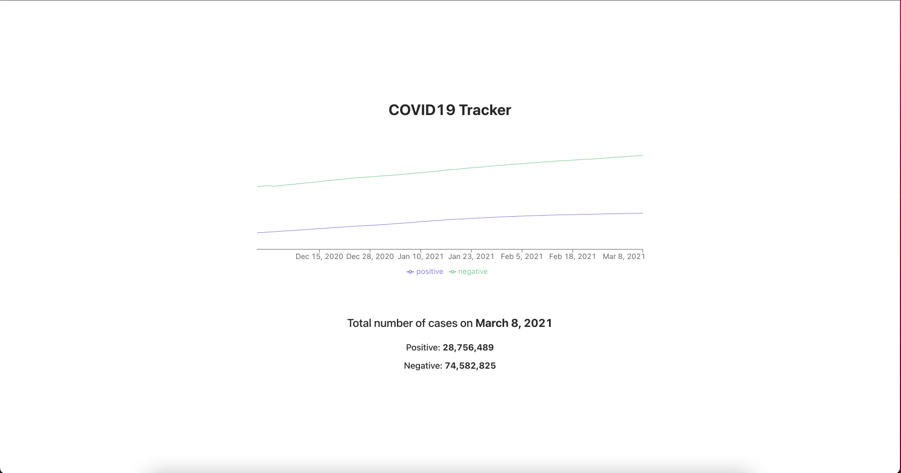

# Frontend onsite interview

## Packages
Go ahead and install the necessary packages in the parent directory with    
```npm install```

## Assessment
For this interview assessment, you will be implementing a basic chart with toggle 
and display functionality. Ideally, you will be able to implement the following screen: 
<br/>

### Tools
1. For the API, only display the first 100 results, and you can call this link: ```https://api.covidtracking.com/v1/us/daily.json``` 
2. For charts, please use Recharts:  
```https://recharts.org/en-US/api```
3. For time formatting, please use momentjs:   
```https://momentjs.com/```

### Features
1. The chart should be clickable
2. Upon click, you should be able to toggle the positive and negative cases on a particular day and display them
3. You should also implement a tooltip for your chart and display only the positive and negative cases for a given day


### Screen to implement
